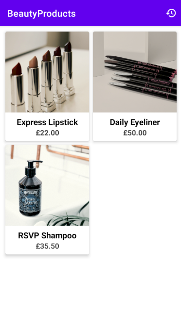
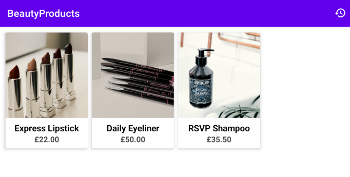
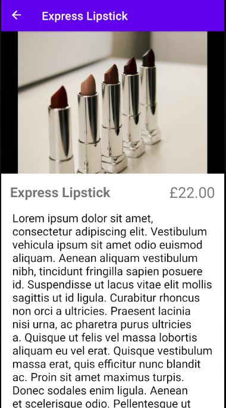
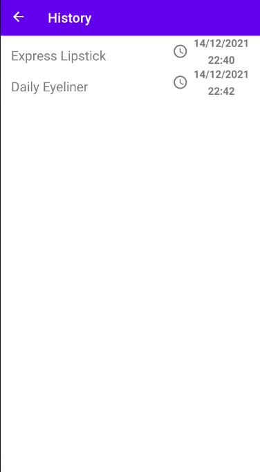
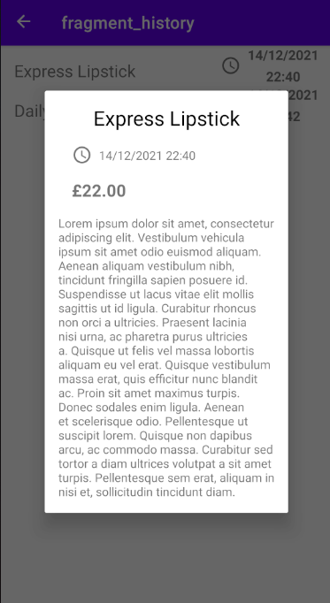

# Reach plc. Apps Team Exercise (Junior) - Submission

Submitted by: Aryan Akbarpour (aryan.akr@yahoo.com)

## Description

## Implementation

### ListFragment
This entry fragment displays a grid of products retrieved from a web server using retrofit. From the options menu, the user can navigate to the history fragment.

The grid is implemented using Jetpack compose as it simplifies creating a responsive grid layout (which would have a different number of columns in each row based on the width of the screen); whilst being as optimised as recycler view when displaying a large number of items. The view model for this fragment retrieves the list of products upon initialisation and provides live data for the view to consume.

Each product is displayed as a card using the composable function ProductsGridItem. The application navigates to the detail fragment for displaying the detail of a selected product.

### DetailFragment
The fragment shows the detail of a product. This fragment takes the title and id of a product as navigation arguments. After fetching the product using retrofit, the product is saved in a local database along with the current timestamp as the last access time. If a product is visited before, only the access time is updated.

### HistoryFragment
This fragment utilises the local database to display the list of previously visited products and their last access time. This list is implemented using a recycler view. Clicking on each item inside the list opens a dialog box showing more detail about the product.

